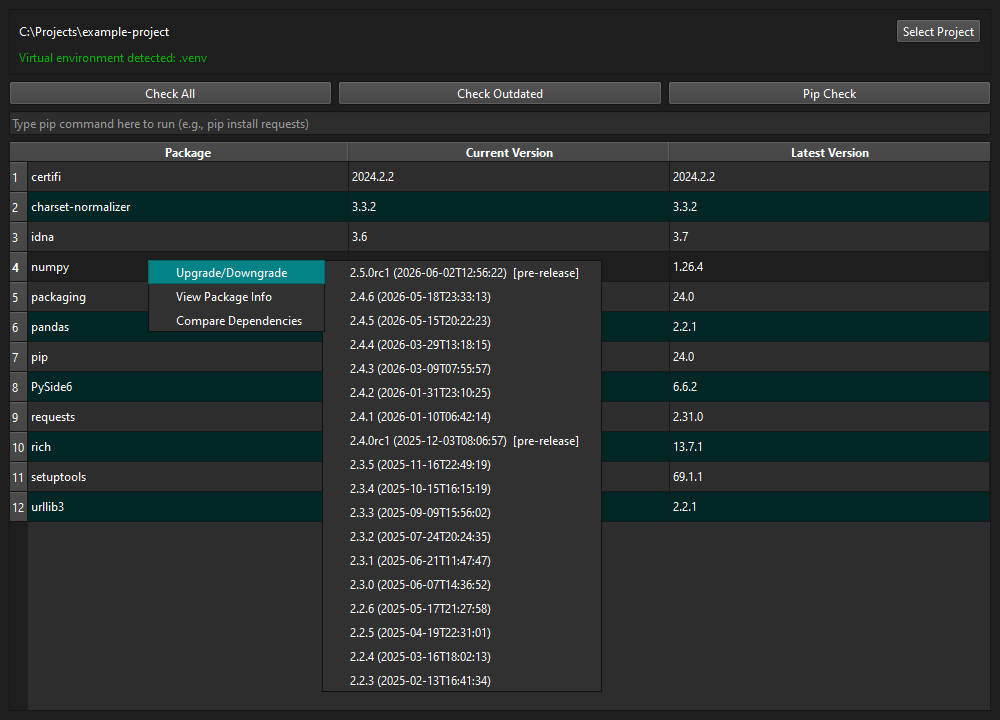

# Python Package Checker

A desktop GUI for inspecting and managing the packages installed in a Python
project's virtual environment — a graphical front-end over `pip` and the PyPI
JSON API, built with PySide6.



## Features

- **Check All** — list every installed package with its current and latest version
- **Check Outdated** — show only packages with a newer release available
- **Pip Check** — report broken or incompatible requirements (`pip check`)
- **Command bar** — run any `pip` command against the selected environment
- **Right-click a package** to:
  - **Upgrade / Downgrade** to any version published on PyPI (installed with `--no-deps`)
  - **View Package Info** — author, homepage, PyPI/docs links, summary
  - **Compare Dependencies** between the installed and latest versions

## Requirements

- Python 3.10 or newer
- [PySide6](https://pypi.org/project/PySide6/) and [packaging](https://pypi.org/project/packaging/)

```bash
pip install -r requirements.txt
```

## Running

```bash
python main.py
```

## Usage

1. Click **Select Project** and choose a folder that contains a virtual
   environment. The app looks for `Scripts\python.exe` (Windows) or
   `bin/python` (Unix) at the folder root, or inside a `venv`, `.venv`,
   `env`, or `.env` subfolder. The environment must have `pip` available.
2. Use **Check All**, **Check Outdated**, or **Pip Check**, or type a `pip`
   command into the command bar and press Enter.
3. Right-click any package row for upgrade/downgrade, package info, or a
   dependency comparison.

> All operations run against the **selected project's** interpreter, not the
> environment this application itself runs in.
